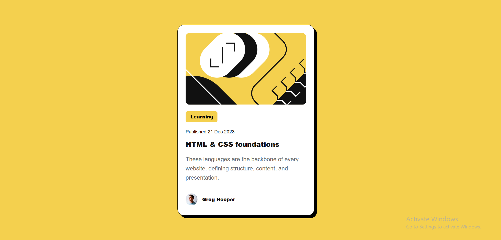
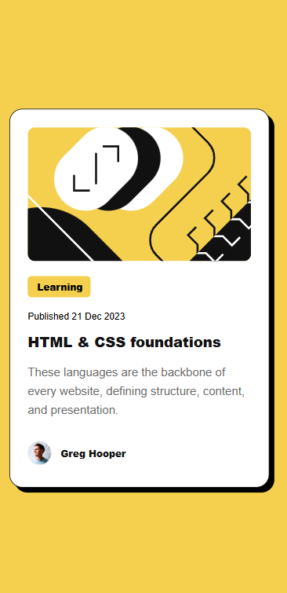

# Frontend Mentor - Blog preview card solution

This is a solution to the [Blog preview card challenge on Frontend Mentor](https://www.frontendmentor.io/challenges/blog-preview-card-ckPaj01IcS). Frontend Mentor challenges help you improve your coding skills by building realistic projects. 

## Table of contents

- [Overview](#overview)  
  - [The challenge](#the-challenge)  
  - [Screenshot](#screenshot)  
  - [Links](#links)  
- [My process](#my-process)  
  - [Built with](#built-with)  
  - [What I learned](#what-i-learned)  
  - [Continued development](#continued-development)  
- [Author](#author)  
- [Acknowledgments](#acknowledgments)  

---

## Overview

### The challenge

Users should be able to:

- See hover and focus states for all interactive elements on the page  
- View the card layout adapt across different screen sizes (mobile to desktop)  

### Screenshot  

**Desktop version**  
  

**Mobile version**  
  

---

### Links  

- **Solution URL:** [https://github.com/Cedric-Celestino/blog-preview-card](https://github.com/Cedric-Celestino/blog-preview-card)  
- **Live Site URL:** [https://cedric-celestino.github.io/blog-preview-card/](https://cedric-celestino.github.io/blog-preview-card/)  

---

## My process  

### Built with

- Semantic **HTML5** markup  
- **CSS custom properties**  
- **Flexbox**  
- **Clamp()** for responsive typography  
- **Mobile-first workflow**  

---

### What I learned  

One of the biggest learnings was how to use the **`clamp()`** CSS function to make typography and layout elements responsive without relying heavily on media queries.  

Example from my project:  

```css
h1 {
  font-size: clamp(1.1rem, 3vw, 1.6rem);
}

This allows the font size to scale smoothly between mobile and desktop screen sizes, while ensuring it never gets too small or too large.

---

### Continued development

In future projects, I want to:

- Explore more **fluid responsive design** techniques without media queries.  
- Use **CSS Grid** in combination with clamp for even more scalable layouts.  
- Experiment with **modern CSS functions** like `min()`, `max()`, and `aspect-ratio`.  

---

## Author

- GitHub - [Cedric-Celestino](https://github.com/Cedric-Celestino)  
- Frontend Mentor - [@Cedric](https://www.frontendmentor.io/profile/Cedric-Celestino)  

---

## Acknowledgments

Thanks to the Frontend Mentor community for providing great feedback and resources, and to everyone sharing tips about **fluid design with clamp** — it made scaling this card design much easier.
